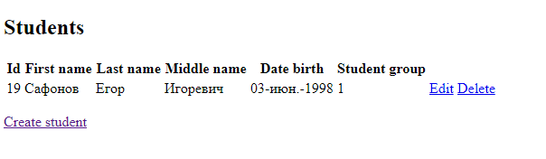

<h1>CRUD приложение</h1>
Это простейшее Web-приложение реализующее концепцию CRUD(create,read,update,delete). 

В качестве данных используется база студентов со следующими полями:

* Уникальный номер студента в базе (Id)
* Имя                              (First name)
* Фамилия                          (Last name)
* Отчество                         (Middle name)
* Дата рождения                    (Date birth)
* Группа студента                  (Student Group)

Приложение написанно с применением следующих технологий:

* Java 11  -                 в качестве языка программирования
* Spring boot & Spring Web - в качестве основы и обертки над данными
* MySQL    -                 в качестве базы данных
* Lombook  -                 в качестве инструмента сокращения кода
* Thymeleaf-                 в качестве шаблонизатора для реализация интерфейса

*Внешний интерфейс базы данных студентов*

*Интерфейс создания нового студента*

*Интерфейс обновления данных студента*

